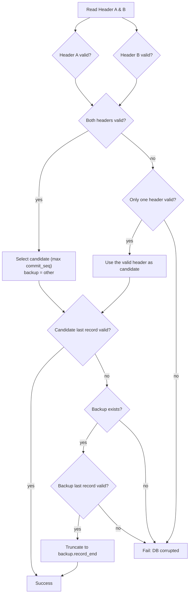

# FacileDB

<!-- Generated by Github Copilot -->

A lightweight, file-based database prototype written in C — built for education, experimentation, and embedded systems.
FacileDB aims for portability and a minimal footprint, making it a good fit for resource-constrained environments.

## Design Philosophy
- Simplicity first: Emphasizes clear, maintainable code that demonstrates essential database concepts rather than covering every edge case.
- Embeddability: Built in portable C with standard POSIX APIs, requiring no external runtime or dependencies.
- Incremental design: The core remains deliberately minimal, enabling features to be added progressively without losing clarity.
- Minimal dependencies: Easy to inspect, modify, and extend — ideal for learning, experimentation, or integration into other projects.

## TODO
- recovery: block
- recovery: delete
- recovery: index
- Discuss: mmap

---

